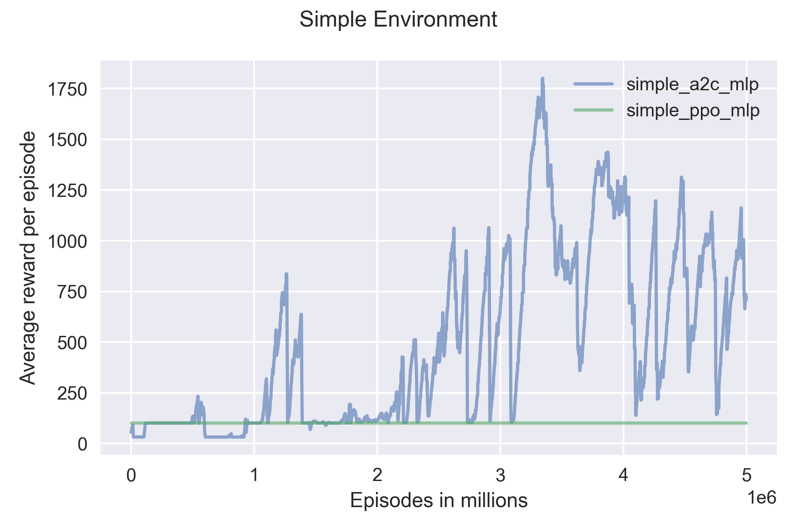

# Training a Reinforcement Learning Agent to Play Flappy Bird
In this project, I trained multiple agents to play the game Flappy Bird using Advantage Actor Critic (A2C) and Proximal Policy Optimization (PPO). There are two environments to choose from, one using only player coordinates to represent state (simple environment) and one using pixel values (rgb environment). Furthermore, there are two policies to choose from, one using a multilayer perceptron (mlp policy) and one using convolution neural networks (cnn policy).

## Install

### Dependencies:
- Python 3.8.3
- packages mentioned in requirements.txt

### Instructions:
- clone flappy-bird-reinforcement-learning
- cd into flappy-bird-reinforcement-learning
- create and activate a custom python virtual environment
- install packages from requirements.txt
```bash
$ python -m pip install -r requirements.txt
```

## Project Structure
### Root-Folder
|File/Folder               |Description|
|---|---|
|`train_agent.py`|Train or run an reinforcement agent using config file.|
|`hyperparameter_tuning.py`|Run hyperparameter tuning given parameters.|
|`saved_models`|Folder to store trained models.|
|`saved_models_hyperparameter`|Folder to store tuned models.|
|`logs`|Folder to store training log files.|
|`logs_hyperparameter`|Folder to store tuning log files.|
|`config`|Folder containing training/run configs.|
|`flappy_bird_gym`|Folder containing the flappy bird gym, originally created by [@Talendar] and slightly modified by  [@doravalerie] and me.|
|`requirements.txt`|Lists all packages used for the project. Designed to be used with pip.|
|`imgs`|This folder contains images displayed in this file.|
|`README.md`|This file.|


### Config files
Training and runtime parameters are stored in a yaml file. It must be stored in the config folder having the following structure:
```
type: [simple/rgb]
hyperparameter:
└───algorithm: [A2C/PPO]
└───policy: [MLP/CNN]
└───learning_rate: float
└───gamma: float
checkpoints:
└───prefix: str
total_timesteps: int
eval_freq: int
frame_stack: Optional[int]
```

## Train an agent
To train an agent, run `train_agent.py` with the train flag and specify the config file:

```bash
$ python .\train_agent.py --train --config .\config\my_config.yml
```

A new folder within `saved_models` and `logs` will be created for the results.


## Run a trained agent
To run a trained agent, run `train_agent.py` with the test flag, specify the config file and the trained model file:

```bash
$ python .\train_agent.py --test --config .\config\my_config.yml --model_path .\saved_models\my_model\best_models\best_model.zip
```


## Hyperparameter Tuning
To start hyperparameter tuning, run `hyperparameter_tuning.py` with the follwing arguments:

```bash
$ python .\hyperparameter_tuning.py --algorithm a2c --timesteps 5000000 --env rgb --policy cnn --trials 20
```

|Parameter|Description|Possible Values|Required|
|---|---|---|---|
|`--algorithm`|Algorithm to use to train the model.|`a2c`, `ppo`|Yes|
|`--timesteps`|Maximal number of timesteps to train a model while tuning.|int|Yes|
|`--env`|Which environment to use.|`simple`, `rgb`|Yes|
|`--policy`|Which policy to use.|`mlp`, `cnn`|Yes|
|`--trials`|The number of different tuning trials.|int|Yes|


A new folder within `saved_models_hyperparameter` and `logs_hyperparameter` will be created for the results.
## Results
The performance of a model is measured in the number of survived steps (frames).

### Custom Configs

|Environment|Config|Lr|Gamma|Best Result|Training Time|
|---|---|---:|---:|---:|---:|
|Simple|PPO MLP|1e-5|0.95|101|4h|
|RGB|PPO MLP|1e-5|0.95|102|17h|
|RGB|PPO CNN|1e-5|0.95|450|15h|
|Simple|A2C MLP|7e-4|0.99|1800|1h|
|RGB|A2C MLP|7e-4|0.99|101|30h|
|RGB|A2C MLP|7e-5|0.95|101|30h|
|RGB|A2C CNN|7e-4|0.99|101|30h|
|RGB|A2C CNN|7e-5|0.95|318|30h|




### Hyperparameter Tuning
|Environment|Config|Lr|Gamma|n_steps|Best Result|
|---|---|---:|---:|---:|---:|
|Simple|PPO MLP|1e-3|0.99|4096|1840|
|RGB|PPO MLP|1e-3|0.90|256|101|
|RGB|PPO CNN|1e-3|0.98|2048|103|
|Simple|A2C MLP|1e-3|0.98|1024|113|
|RGB|A2C MLP|1e-5|0.98|512|101|
|RGB|A2C CNN|1e-5|0.95|8192|101|